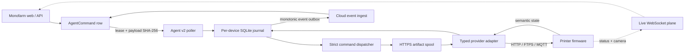
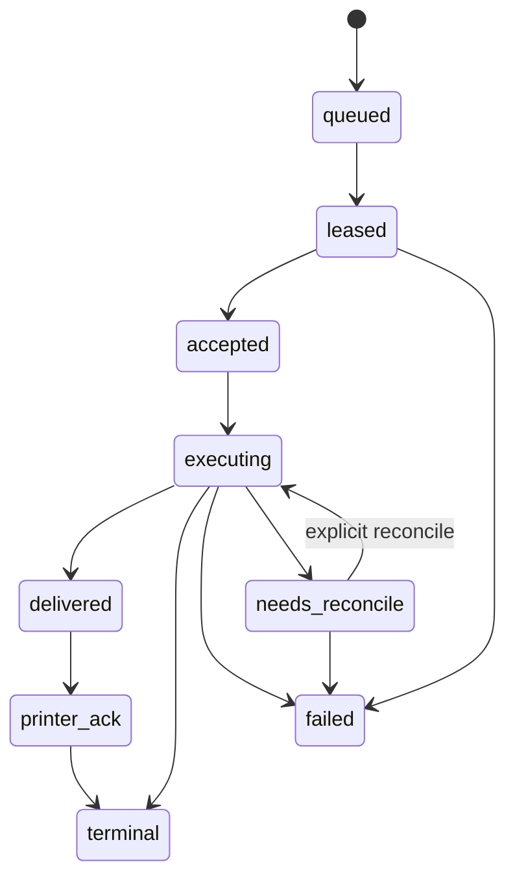

# Monofarm Agent Runtime v2

**Version:** 0.9.1
**Updated:** 2026-07-14
**Status:** production-hardened implementation; hardware/firmware lab gate remains

This document is the current source of truth for what runs on a farm PC, how a
cloud action reaches a printer, and which compatibility claims are supported by
code rather than inference. The SimplyPrint clean-room audit and historical gap
analysis are in [AGENT_SIMPLYPRINT_ENGINEERING_AUDIT.md](AGENT_SIMPLYPRINT_ENGINEERING_AUDIT.md).

## Runtime architecture



There are two deliberately separate planes:

- The durable control plane owns physical actions: upload, start, pause,
  resume, cancel, status, snapshot metadata and explicit reconcile.
- The live WebSocket plane carries status pushes, camera streams, Telegram,
  discovery and restricted v1 relay calls during migration.

The cloud does not provide a host, port or arbitrary HTTP method inside a v2
printer command. The agent first downloads authenticated `runtime-config` and
builds a fixed registry keyed by the Monofarm printer ID. This blocks a command
from turning the farm PC into a generic LAN proxy.

## Pairing and authentication

1. An admin creates a one-time pairing code (valid for at most 30 minutes).
2. The agent generates an Ed25519 key locally and exchanges the code once.
3. The backend stores an `AgentDevice`; the farm PC stores its device secret in
   `~/.monofarm-agent/.env` with owner-only permissions.
4. The device secret mints a five-minute JWT with only the configured agent
   scopes.
5. The v2 WebSocket sends this token in `Authorization: Bearer`, not in the URL.
6. Revocation or credential rotation closes an open socket through a fresh-DB
   watchdog check.

The old `/api/agent/connect?token=<user JWT>` route is migration-only. New
installs never persist an admin/user JWT.

## Command lifecycle and crash semantics



- The agent validates the exact envelope and payload digest before persistence.
- The SQLite journal is committed before any printer side effect.
- A monotonic outbox is deleted only through the highest contiguous sequence
  acknowledged by the server.
- Active commands renew a five-minute lease. A crashed worker's expired active
  lease becomes eligible for redelivery.
- Completed local command IDs replay the stored outcome without repeating the
  physical action.
- An interrupted or ambiguous `printer.start` enters `needs_reconcile`; it is
  never automatically started a second time.
- MQTT PUBACK and HTTP 2xx mean delivery only. Success requires printer state
  correlated to the exact Bambu task ID or Moonraker filename.

## Artifact lifecycle

`printer.upload` accepts only:

```json
{
  "source_url": "https://allowlisted-host/signed-object",
  "file_name": "part.gcode.3mf",
  "expected_size": 1234567,
  "expected_sha256": "64-lowercase-hex-characters",
  "expires_at": "2026-07-14T02:00:00Z"
}
```

The downloader requires HTTPS, a hostname supplied by authenticated runtime
config, an exact size and SHA-256. It streams in 64 KiB chunks to a `.part`
file, supports HTTP range resume, enforces a configurable maximum and free-disk
reserve, calls `fsync`, then atomically renames. It never holds a print file in
RAM. The default limit is 2 GiB (`MONOFARM_MAX_ARTIFACT_BYTES`).

### Durable Moonraker dispatch boundary

The durable Moonraker bridge accepts only byte-for-byte dispatches. A generic
Moonraker job may include an identity slot map, but the agent must receive the
same filename and artifact bytes selected by the operator. Upload success is
correlated to `provider=moonraker` and that exact filename; start/reconcile then
require the same printer reference. After the agent confirms the start, the job
remains `acknowledged` so the existing print tracker owns the running and
terminal lifecycle.

The backend falls back to the existing Moonraker dispatcher before reading the
artifact or mutating the job when a request needs any transformation: a
non-identity slot remap, bed-level/timelapse/AI option override,
`calibrate_slots`, metadata-driven unused-slot filtering, or any Snapmaker U1
slot mapping. A U1 job without slot mapping can use the durable path. This
boundary preserves the current U1 mapping macro and avoids presenting a
different artifact to the printer than the one verified by the agent.

## Operational provider matrix

| Provider | Models currently accepted | Upload | Start confirmation | Control | Camera |
| --- | --- | --- | --- | --- | --- |
| Bambu LAN | P1S, A1, A1 mini | implicit FTPS `:990`, 64 KiB chunks | exact MQTT `task_id` + firmware state | MQTT pause/resume/stop + state confirmation | native TLS `:6000` where supported |
| Moonraker / Klipper | generic Klipper, Snapmaker U1 | multipart HTTP, `print=false` | exact filename + `print_stats.state` | fixed Moonraker endpoints + state confirmation | configured Moonraker webcam snapshot/stream |

This is not a universal brand claim. OctoPrint, PrusaLink/Prusa Connect, Duet,
Creality, Elegoo, Anycubic and other protocols require a separate typed adapter,
fixtures and live hardware certification before they can be marked operational.
The provider registry is intentionally extensible, but unknown transports and
models fail closed.

## Local and network security

- Local setup HTTP/WebSocket servers bind only to loopback and validate
  `Host`/`Origin`.
- Legacy Moonraker HTTP is restricted to registered private targets and known
  methods. Link-local metadata, loopback, public IP and unregistered LAN hosts
  are rejected.
- Raw TCP printing is restricted to explicitly configured ZPL IP/port pairs.
- TLS verification never downgrades automatically. Firmware-specific exceptions
  require an explicit exact target in
  `MONOFARM_BAMBU_INSECURE_TARGETS` or
  `MONOFARM_MOONRAKER_INSECURE_TARGETS`.
- Stream queues are bounded and drop stale frames; disconnect cleanup cancels
  producers, subscriptions and partial upload files.
- Sensitive values are absent from browser payloads and tracked documentation.

## Installation and update chain

- Windows installs the PyInstaller tray executable.
- Linux/Pi uses a versioned source release with an atomic `current` symlink;
  its Python environment is still shared between releases.
- Pre-modular agents migrate through the historical HTTPS bootstrap route. The
  bootstrap now contains the committed production trust root and activates
  only a release signed by that key, so old Linux `.env` files need no manual
  key provisioning.
- Normal OTA uses a CI-produced Ed25519-signed immutable manifest, exact source
  allowlist, artifact sizes/SHA-256, freshness and downgrade checks, staged
  compile/import health checks and atomic activation. Linux retains the prior
  release symlink. The Windows installer retains the prior executable until the
  candidate passes its loopback health check; frozen in-app OTA does not yet
  have an external watchdog rollback.

The public trust root is committed at `agent/release_public_key.b64` and copied
verbatim into the legacy bootstrap, current runtime, Linux/Windows installers,
backend and frontend. `agent/test_release_sync.py` prevents drift. The first
bootstrap or executable download still relies on the production HTTPS origin;
every artifact activated after that is checked against the signed manifest.

Backend release configuration has a production URL default and needs no secret:

```env
AGENT_UPDATE_BASE_URL=https://api.monofarm.app
AGENT_RELEASE_ATTESTATION_PUBLIC_KEY=<optional identical override; mismatch is rejected>
```

The frontend imports the committed key directly, displays signed-release
readiness and disables the Windows download until the backend verifies the
matching immutable manifest. Settings also shows each device version and edits
explicit printer-to-AgentDevice assignments.

The raw Ed25519 private key exists only as the
`AGENT_RELEASE_ATTESTATION_PRIVATE_KEY` GitHub Actions secret. Its derived
public key must match the committed trust root or release publication fails. CI uploads every
versioned source artifact and the attested Windows executable, then uploads
`agent/releases/<version>/manifest.json` last. The backend cannot mint or alter
a release manifest; invalid trust configuration fails closed. Both installers
have the pinned key built in. An optional Windows SHA-256 pin may add an
independent channel, while the default installer checks the backend-verified
manifest size and digest.

The main CI workflow computes an agent release plan. A changed runtime with no
version bump fails immediately; a version bump invokes the reusable signed
release workflow after backend/frontend verification. The existing production
deploy workflow starts only after that whole CI run succeeds, so cloud and edge
versions cannot deploy out of order.

## Production gates that cannot be proven by unit tests

- Run the firmware matrix on physical P1S, A1, A1 mini, Snapmaker U1 and at
  least one generic Moonraker/Klipper printer.
- Exercise power loss during download, FTPS upload and immediately after start;
  confirm no duplicate physical start.
- Validate slow Wi-Fi, DHCP address changes, expired signed URLs, full disk,
  revoked device credentials and backend restart.
- Provision and rotate the CI OTA signing key and the installer trust channel,
  then verify a real Windows and Linux upgrade plus rollback.
- Validate frozen Windows in-app OTA under crash/power-loss before enabling it
  broadly; only the Windows installer currently performs candidate rollback.
- Multi-host routing uses explicit printer-to-`AgentDevice` assignment. During
  migration, the sole unscoped device in an organization may inherit an
  unassigned printer; a site-scoped device can execute only printers explicitly
  assigned to it. Multi-host failover still requires a hardware lab gate.

Until those gates pass, describe 0.9.1 as a production-hardened runtime, not as
universal hardware certification.
