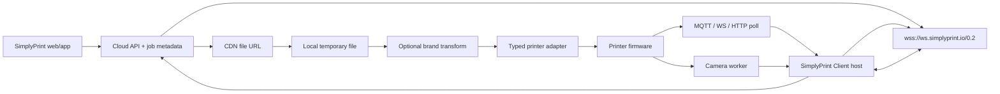
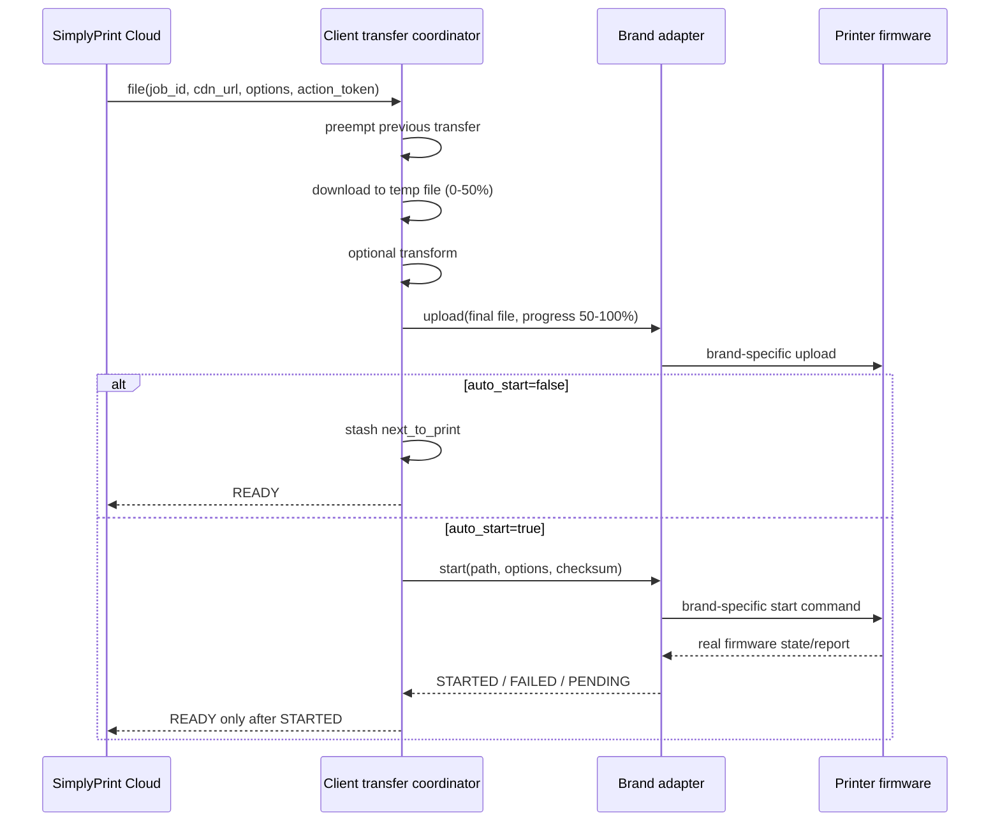
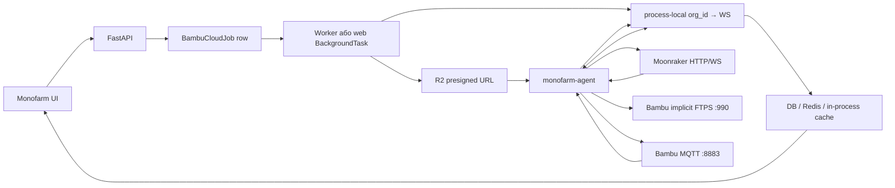
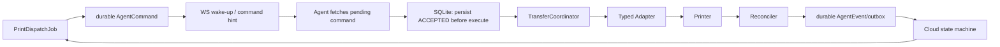

# SimplyPrint Client під капотом і план Monofarm Agent vNext

**Дата аудиту:** 2026-07-13

**Monofarm baseline:** `HEAD 9dba872`, опублікований `agent-v0.8.9`; у working tree є незакомічений bump до `0.8.10` і redesign tray UI

**Статус документа:** канонічний engineering-аудит агента; старий [COMPETE_SIMPLYPRINT.md](COMPETE_SIMPLYPRINT.md) лишається продуктовим snapshot і містить застарілі технічні твердження

> **Implementation update — 2026-07-14.** Baseline вище є історичним
> знімком до реалізації. У working tree `v0.9.0` вже закрито основний P0/P1:
> dedicated AgentDevice pairing і short-lived scoped tokens, revocation watchdog,
> durable SQLite command journal + monotonic outbox, bounded verified artifact
> spool, typed Moonraker/Bambu LAN adapters, semantic start confirmation і
> reconcile, loopback-only tray control plane, strict LAN target policy,
> signed manifest та atomic distribution/migration. Незмінені Moonraker jobs
> тепер проходять той самий durable upload/start/reconcile lifecycle; requests,
> які потребують slot/G-code transformation, fail closed у v2 і до будь-якої
> DB/file mutation повертаються на наявний legacy dispatcher. Printer routing
> використовує explicit `Printer.agent_device_id`; лише один unscoped device
> може тимчасово успадкувати unassigned printer під час migration. Code-level transport tests
> пройдені; live hardware/firmware certification у цій сесії не проводилась.
> Operational scope зараз: Bambu P1S/A1/A1 mini і Moonraker/Klipper
> (включно зі Snapmaker U1). Інші бренди не позначаються operational без
> окремого адаптера та lab gate.

## Короткий висновок

SimplyPrint Client не використовує один «секретний універсальний протокол». Це edge bridge із чотирьох шарів:

1. один outbound WebSocket до SimplyPrint Cloud;
2. окремий логічний client на кожен принтер, мультиплексований через поле `for`;
3. спільний transaction-like file lifecycle: `download → transform → upload → start → firmware ACK`;
4. typed brand adapters для MQTT, WebSocket, HTTP/REST, FTP/FTPS, камер і discovery.

Його найсильніші інженерні рішення:

- однакова transfer state machine для всіх брендів;
- успіх start визначається фактичним станом firmware, а не лише успішним send;
- stable hardware identity і rediscovery після DHCP-зміни;
- ізольовані printer drivers, camera worker pool і багатопринтерний cloud channel;
- signed TUF OTA з A/B slots, health check і rollback.

На baseline аудиту Monofarm уже мав конкурентне printer-specific ядро: Bambu Cloud/LAN/hybrid, Moonraker, Snapmaker U1, durable job rows, Bambu correlation, R2 → agent download, FTPS/MQTT, status push і камери. Тоді edge execution ще не був production-grade fleet runtime. Найкритичніші розриви на той момент:

- звичайний user JWT використовується як agent credential;
- локальний tray UI у випущеному `v0.8.9` віддає JWT будь-якому LAN WebSocket-клієнту;
- generic proxy перетворює agent на потенційний LAN pivot;
- LAN/Moonraker jobs виконуються transient `BackgroundTask` у web process і не мають crash recovery;
- cloud↔agent commands, pending responses і streams зберігаються лише в RAM;
- немає локального journal, idempotent replay і reconcile після ambiguous start;
- updater не перевіряє signature/hash і не має rollback;
- Moonraker upload може буферизувати весь файл у RAM;
- tunnel і status caches не готові до multi-replica/multi-site.

Об’єктивно стати кращими за SimplyPrint можна не копіюванням їхнього закритого коду, а закриттям слабкого місця, яке є і в їхньому публічному core: зробити **durable exactly-once-at-the-printer command lifecycle** з reconcile, SHA-256, local-first queue та authenticated control plane.

---

## 1. Межі та достовірність дослідження

### 1.1 Що було використано

- офіційні setup/help/network сторінки SimplyPrint;
- офіційний Linux installer і офіційний Linux x86_64 bundle;
- публічний AGPL-проєкт [`simplyprint-ws-client`](https://github.com/SimplyPrint/simplyprint-ws-client/tree/a9fa26d2845634483fca32e5b8e5e9d8b8e8d37b), exact commit, вбудований у поточний Client bundle;
- публічний [OctoPrint plugin](https://github.com/SimplyPrint/OctoPrint-SimplyPrint/tree/16c9417ad566bce74504e1354dbab13afbceac8c);
- публічний [Duet connector](https://github.com/SimplyPrint/integration-duet3d/tree/62cc003a015e99f0504d4814f581ab771a3e8ab5);
- публічний SimplyPrint component у [Moonraker](https://github.com/Arksine/moonraker/blob/d5ee17128bb88434aacdab90c2e9e990e2b64e4a/moonraker/components/simplyprint.py);
- статичний список модулів захищених brand adapters у офіційному bundle;
- поточний Monofarm source tree та тести.

Офіційний Linux artifact, перевірений 2026-07-13:

```text
URL: https://download.simplyprint.io/client/simplyprint-client-linux-x86_64.tar.gz
Size: 75,346,959 bytes
SHA-256: 4d8b5d4588c25c82afc5f9cc199dccd8dc5b2269f59ff236e962c5bcb202a1fb
Bundled public core: simplyprint-ws-client 2.0.0
Core commit: a9fa26d2845634483fca32e5b8e5e9d8b8e8d37b
```

### 1.2 Що не робилося

- не обходився PyArmor або інший захист;
- не розшифровувався і не копіювався proprietary brand code;
- не використовувалися чужі акаунти, токени чи принтери;
- не перехоплювався чужий трафік;
- exact private payload кожного нового brand adapter не оголошується фактом без lab test.

### 1.3 Позначки доказовості

| Позначка | Значення |
|---|---|
| **SOURCE** | Точна поведінка є у публічному source code |
| **STATIC** | Модуль/залежність/asset є в офіційному bundle, але implementation body захищений |
| **OFFICIAL** | Поведінка заявлена в офіційній документації SimplyPrint |
| **INFERENCE** | Обґрунтований висновок із модулів, залежностей і відомого printer protocol |
| **LAB** | Потрібно підтвердити на власному account/printer/firmware |

---

## 2. SimplyPrint Client 1.x: загальна архітектура

SimplyPrint у червні 2026 року представив новий cross-platform Client як заміну старого Bambu-only client. Він працює на Windows, macOS, Linux і Docker, має локальний UI на `:8000` та може вести багато принтерів різних брендів з одного host. Офіційні джерела: [launch post](https://simplyprint.io/blog/new-simplyprint-client-elegoo-centauri-more/), [setup guide](https://simplyprint.io/setup-guide/methods/simplyprint-client), [Bambu setup](https://simplyprint.io/setup-guide/bambu-lab/setup).



Важлива продуктова властивість: cloud не stream-ить G-code рядок за рядком під час друку. Файл спочатку опиняється локально біля printer/host, тому вже розпочатий print продовжується після втрати SimplyPrint Cloud або Client connection. Це прямо підтверджують [setup guide](https://simplyprint.io/setup-guide/methods/simplyprint-client) і [FAQ](https://simplyprint.io/faq).

### 2.1 Process/runtime layout

Офіційний bundle містить:

- Python 3.13 PyInstaller onedir runtime;
- local web API/UI, CLI і TUI;
- account, onboarding, discovery, printer, backup/restore, logs і diagnostics endpoints;
- public `simplyprint-ws-client 2.0.0` core;
- protected brand adapters;
- aiohttp, websockets, paho-mqtt, FTPS/FTP support, PyAV/FFmpeg libs, `libdatachannel`, `curl_cffi`, Pillow, cryptography, APScheduler, psutil;
- Bambu CA certificate;
- TUF root metadata і OS-specific restart/update scripts;
- native launcher поза Python update slots.

Це не доказує точну команду кожного бренду, але точно показує runtime boundaries: cloud core, discovery, drivers, transfer coordinator, camera pool, local control plane і OTA є окремими підсистемами.

---

## 3. Cloud handshake, identity і multi-printer routing

### 3.1 Cloud URL і transport

**SOURCE:** [`core/protocol/connection.py`](https://github.com/SimplyPrint/simplyprint-ws-client/blob/a9fa26d2845634483fca32e5b8e5e9d8b8e8d37b/simplyprint_ws_client/core/protocol/connection.py#L32-L84)

Single-printer і multi-printer URLs:

```text
wss://ws.simplyprint.io/0.2/p/{id}/{token}
wss://ws.simplyprint.io/0.2/mp/{id}/{token}
```

Поточні transport settings:

| Параметр | Значення |
|---|---:|
| WebSocket ping interval | 30 s |
| ping timeout | 30 s |
| open timeout | 60 s |
| close timeout | 10 s |
| first server message | ≤30 s |
| max frame size | unlimited |
| reconnect delay | constant 5 s, retry forever |

### 3.2 Дві різні identity

**SOURCE:** [`integration/discovery/identity.py`](https://github.com/SimplyPrint/simplyprint-ws-client/blob/a9fa26d2845634483fca32e5b8e5e9d8b8e8d37b/simplyprint_ws_client/integration/discovery/identity.py), [`reconcile.py`](https://github.com/SimplyPrint/simplyprint-ws-client/blob/a9fa26d2845634483fca32e5b8e5e9d8b8e8d37b/simplyprint_ws_client/integration/discovery/reconcile.py)

- `unique_id` — стабільний logical slot усередині Client;
- hardware identity — serial/board GUID, а за відсутності стабільнішого ID може використовуватися MAC.

Logical slot не треба міняти лише через DHCP. Hardware identity потрібна для dedupe, повторного discovery і визначення, що знайдений пристрій — той самий printer за новою IP.

### 3.3 Один WSS, багато принтерів

**SOURCE:** [`messages.py`](https://github.com/SimplyPrint/simplyprint-ws-client/blob/a9fa26d2845634483fca32e5b8e5e9d8b8e8d37b/simplyprint_ws_client/core/protocol/messages.py#L627-L649), [`manager.py`](https://github.com/SimplyPrint/simplyprint-ws-client/blob/a9fa26d2845634483fca32e5b8e5e9d8b8e8d37b/simplyprint_ws_client/core/manager.py#L108-L218)

У multi mode Client додає кожен printer як logical connection із:

```text
pid
token
unique_id
allow_setup
client_ip
```

Cloud і Client маршрутизують printer-specific JSON полем:

```json
{"type":"...","data":{},"for":"<unique_id>"}
```

Новий непарений printer отримує `short_id`/token, користувач завершує setup у cloud, після чого logical connection прив’язується до cloud printer ID.

### 3.4 Відокремлення cloud membership від device liveness

**SOURCE:** [`integration/client.py`](https://github.com/SimplyPrint/simplyprint-ws-client/blob/a9fa26d2845634483fca32e5b8e5e9d8b8e8d37b/simplyprint_ws_client/integration/client.py#L238-L288)

Коли фізичний printer зникає:

- logical printer не видаляється з cloud connection;
- нормалізований стан стає `offline`;
- camera URI очищається;
- його driver продовжує reconnect;
- повернення TCP/WS/MQTT саме по собі не ставить `online` — потрібен реальний device report.

Це прибирає churn і false-online стани.

---

## 4. Exact file dispatch lifecycle

### 4.1 Cloud demand

**SOURCE:** [`FileDemandData`](https://github.com/SimplyPrint/simplyprint-ws-client/blob/a9fa26d2845634483fca32e5b8e5e9d8b8e8d37b/simplyprint_ws_client/core/protocol/messages.py#L309-L322)

Cloud `file` demand не передає сам файл. Він передає descriptor:

```text
job_id
url
cdn_url
auto_start
file_name
file_id
file_size
start_options
mms/material mapping
skip_objects
action_token
```

### 4.2 Спільний transfer coordinator

**SOURCE:** [`integration/transfer/file_transfer.py`](https://github.com/SimplyPrint/simplyprint-ws-client/blob/a9fa26d2845634483fca32e5b8e5e9d8b8e8d37b/simplyprint_ws_client/integration/transfer/file_transfer.py)



Алгоритм:

1. новий file demand preempt-ить transfer, що вже виконується;
2. coordinator claim-ить `job_id` і `action_token`;
3. download із CDN займає 0–50% progress;
4. adapter може трансформувати файл;
5. upload на printer займає 50–100%;
6. для `auto_start=false` prepared file зберігається як `next_to_print`;
7. для `auto_start=true` adapter надсилає start;
8. `READY` виставляється лише після firmware state, який adapter класифікував як `STARTED`;
9. firmware reject або timeout переводить prepare у `ERROR`.

Поточні reliability constants:

| Механізм | Значення |
|---|---:|
| Firmware start grace | 60 s |
| Retry budget | 3 retries + first attempt = 4 total |
| Retry backoff | 2 s |
| No-progress watchdog | 10 min |
| Watchdog tick | 5 s |
| Cooperative preemption grace | 50 ms, потім task cancel |

Brand adapter реалізує лише hooks:

```text
_upload
_send_start
_firmware_outcome
optional transform
optional existing-file lookup
device-specific error mapping
device-side progress
```

Саме цей abstraction варто відтворити clean-room у Monofarm.

### 4.3 CDN download і temp storage

**SOURCE:** [`core/files/file_download.py`](https://github.com/SimplyPrint/simplyprint-ws-client/blob/a9fa26d2845634483fca32e5b8e5e9d8b8e8d37b/simplyprint_ws_client/core/files/file_download.py)

- спочатку пробується `cdn_url`, потім `url`;
- fallback дозволений лише доки не отримано жодного byte;
- після partial body інший URL не використовується, щоб не склеїти два різні файли;
- `connect=5s`, socket connect `10s`, consecutive read timeout `30 min`, total timeout відсутній;
- chunks пишуться в temp file off-loop;
- temp directory прибирається після завершення context;
- MD5 рахується для фінального post-transform файлу.

### 4.4 Важливе обмеження integrity

Публічний core обчислює MD5, але cloud descriptor не містить trusted SHA-256. Це означає:

- digest може використовуватися adapter-ом для printer protocol;
- він не доводить, що CDN повернув саме очікуваний cloud artifact;
- `file_size` у schema є, але generic downloader не робить його обов’язковою integrity-перевіркою.

Це конкретна можливість бути кращими: передавати signed manifest `{url, size, sha256, transform_spec_hash}` і вважати download успішним лише після перевірки.

---

## 5. Printer drivers, controls, status і camera

### 5.1 Generic driver contract

**SOURCE:** [`integration/drivers.py`](https://github.com/SimplyPrint/simplyprint-ws-client/blob/a9fa26d2845634483fca32e5b8e5e9d8b8e8d37b/simplyprint_ws_client/integration/drivers.py)

Один printer client може оголосити:

- `WsDriver`;
- `MqttDriver`;
- `DevicePoller`.

Shared layer керує lifecycle, restart при зміні IP/credential, reconnect, single-flight credential refresh і offline timeout. Brand code лише парсить device payload та реалізує commands.

### 5.2 Cloud control demands

**SOURCE:** [`core/protocol/messages.py`](https://github.com/SimplyPrint/simplyprint-ws-client/blob/a9fa26d2845634483fca32e5b8e5e9d8b8e8d37b/simplyprint_ws_client/core/protocol/messages.py)

Protocol має demands для:

- pause/resume/cancel;
- raw G-code і terminal;
- webcam test/snapshot/stream;
- file/start print;
- printer connect/disconnect;
- host/API restart/shutdown;
- update/plugin install/uninstall;
- printer profile;
- material/peripheral refresh/actions;
- skip objects;
- PSU;
- logs.

Але **SOURCE:** generic [`PrinterClient` handlers](https://github.com/SimplyPrint/simplyprint-ws-client/blob/a9fa26d2845634483fca32e5b8e5e9d8b8e8d37b/simplyprint_ws_client/integration/client.py#L290-L329) за замовчуванням лише логують unhandled demand. Реальна підтримка залежить від конкретного brand adapter.

### 5.3 Normalized state guards

Shared state logic не дозволяє transient device report зламати operator-visible transition:

- `cancelling` не повертається у `printing`, доки firmware не підтвердить вихід;
- за opt-in аналогічно тримається `pausing`;
- `operational` не затирає `downloading` під час transfer;
- print started/finished визначається через firmware edges.

Це варто залишити provider-neutral, а не дублювати в кожному adapter.

### 5.4 Camera

**SOURCE:** [`integration/camera`](https://github.com/SimplyPrint/simplyprint-ws-client/tree/a9fa26d2845634483fca32e5b8e5e9d8b8e8d37b/simplyprint_ws_client/integration/camera), [`simplyprint_api.py`](https://github.com/SimplyPrint/simplyprint-ws-client/blob/a9fa26d2845634483fca32e5b8e5e9d8b8e8d37b/simplyprint_ws_client/core/api/simplyprint_api.py#L30-L55)

- brand camera або operator custom camera URL;
- worker може працювати inline, у thread або process;
- frame cache за замовчуванням придатний до 1 s;
- worker залишається hot до 60 s без poll, бо cloud snapshot cadence близько 15 s;
- live frames передаються base64 через WSS;
- ID snapshot може POST-итися на `jobs/ReceiveSnapshot` або server-supplied endpoint;
- офіційний FAQ каже, що snapshot relay видаляє кадр після використання.

Camera є окремою bounded/coalescing subsystem, тому повільний RTSP/decoder не має блокувати cloud control loop.

---

## 6. Adapter matrix нового Client

Нижче **STATIC**, якщо окремо не вказано **SOURCE/OFFICIAL**. Назви модулів підтверджують компоненти, але не дають права стверджувати exact private command payload.

| Adapter | Що є в офіційному Client bundle | Ймовірний printer-side transport | Статус твердження |
|---|---|---|---|
| Bambu | account/cloud API, LAN probe/discovery, `ftp_client`, files, protocol commands/connection, AMS/materials, raw JPEG і RTSP camera, CA manager | FTPS/FTP + MQTT-like LAN/cloud protocol | Components **STATIC**; exact current commands **LAB** |
| Anycubic | SSDP, handshake, connection, commands, files, camera, ACE/material layout | SSDP + persistent device protocol | **STATIC** |
| Creality | discovery/probe, connection/commands, files, CFS, peripherals, bed mesh, go2rtc/WebRTC | mDNS/probe + WS/HTTP family | **STATIC** |
| Duet | discovery, REST API, Object Model, files, G-code, webcam | Duet REST/Object Model | **STATIC**; older exact connector is **SOURCE** |
| Elegoo | CC/CC2 connection/device/files, API, probe, materials/peripherals | device-specific WS/API | **STATIC** |
| Ultimaker | discovery, REST, state, files | Ultimaker REST | **STATIC** |
| Moonraker | discovery/probe, HTTP, RPC, connection, commands, files, camera, device errors | Moonraker HTTP + WebSocket RPC | Bundle **STATIC**; публічна GA-доступність **LAB** |
| Snapmaker | discovery, files, commands, device errors, materials/tool state | Snapmaker device protocol | Bundle **STATIC**; публічна GA-доступність **LAB** |

Новий Client не містить universal OctoPrint або PrusaLink adapter. OctoPrint і Prusa в SimplyPrint мають окремі integration paths.

### 6.1 Legacy OctoPrint — точний public flow

**SOURCE:** [OctoPrint plugin 4.2.3](https://github.com/SimplyPrint/OctoPrint-SimplyPrint/tree/16c9417ad566bce74504e1354dbab13afbceac8c)

```text
Cloud file demand
  → HTTP stream у temp file
  → add to OctoPrint local storage /SimplyPrint
  → select file
  → optional printer.start_print()
  → wait up to 10 s for OctoPrint PRINT_STARTED event
```

Controls:

- pause → `printer.pause_print()`;
- resume → `printer.resume_print()`;
- cancel → `printer.cancel_print()`;
- G-code → `printer.commands()`;
- camera → local snapshot URL, JPEG base64 через cloud.

Plugin зберігає `last_downloaded_file` лише в RAM, а generic command ID/idempotency немає. Це legacy connector, не архітектура нового universal Client.

### 6.2 Direct Moonraker connector — точний public flow

**SOURCE:** [Moonraker SimplyPrint component](https://github.com/Arksine/moonraker/blob/d5ee17128bb88434aacdab90c2e9e990e2b64e4a/moonraker/components/simplyprint.py), [official installer](https://download.simplyprint.io/klipper/moonraker-sp.sh)

Installer створює окремий `moonraker-sp` instance на `:7126`, який використовує той самий Klippy UDS і gcode directory, не змінюючи main Moonraker instance.

Flow:

```text
cloud WS /0.1/p/{id}/{token}
  → download file у temp
  → Moonraker file_manager.finalize_upload
  → klippy_apis.start_print
  → Klippy object subscriptions → cloud state/job events
```

Controls використовують `pause_print`, `resume_print`, `cancel_print`, `run_gcode`. Camera бере локальний snapshot і передає base64/HTTP snapshot. Звичайні outbound messages губляться offline; є лише невеликий спеціальний buffer terminal job events.

### 6.3 Duet public precedent

**SOURCE:** [integration-duet3d](https://github.com/SimplyPrint/integration-duet3d/tree/62cc003a015e99f0504d4814f581ab771a3e8ab5)

Старий connector використовує Duet session auth, Object Model/REST, CRC32 upload і G-code lifecycle приблизно такого виду:

- upload у `0:/gcodes/...`;
- select/start → `M23` + `M24`;
- pause → `M25`;
- resume → `M24`;
- cancel → `M25` + `M0`.

Це доказ protocol precedent, але не гарантія, що protected Duet adapter у Client 1.x реалізований line-for-line так само.

---

## 7. Reconnect, offline і втрата повідомлень у SimplyPrint

### 7.1 Що зроблено добре

**SOURCE:** [`wire/reconnect.py`](https://github.com/SimplyPrint/simplyprint-ws-client/blob/a9fa26d2845634483fca32e5b8e5e9d8b8e8d37b/simplyprint_ws_client/wire/reconnect.py)

- один supervised task володіє connect/consume/drop/backoff loop;
- failed send `trip`-ить current connection;
- generation counter не дає late failure старого socket знищити новий socket;
- reconnect відбувається нескінченно;
- після reconnect state fields позначаються changed і convergent snapshot перевідправляється.

### 7.2 Що не є durable

**SOURCE:** [`core/protocol/protocol.py`](https://github.com/SimplyPrint/simplyprint-ws-client/blob/a9fa26d2845634483fca32e5b8e5e9d8b8e8d37b/simplyprint_ws_client/core/protocol/protocol.py#L182-L206)

- outbound message під час disconnected state просто drop-иться;
- generic durable outbox/replay відсутній;
- control demand schema не має universal `command_id` і ACK lifecycle;
- transfer і `next_to_print` — RAM state;
- process crash recovery transfer/start у public core не підтверджена;
- inbound FIFO unbounded; після depth 100 лише пишеться stall warning.

Отже SimplyPrint має сильний connection recovery, але public core не доводить exactly-once command execution. Це наша головна можливість для переваги.

---

## 8. Update architecture SimplyPrint

**SOURCE/STATIC:** [official Linux installer](https://download.simplyprint.io/client/install-linux.sh), bundle TUF assets

```text
/opt/simplyprint/
  launcher/                 native supervisor, поза slots
  install/
    state.json              atomic active-slot pointer
    slots/A
    slots/B
    data/
    tuf/
    dl/
```

- systemd запускає native launcher, а не Python slot;
- update ставиться у inactive slot;
- TUF metadata підписує targets/snapshot/timestamp;
- launcher перевіряє health/start budget;
- `Restart=on-failure`, `RestartSec=1`, `StartLimitIntervalSec=0` дають launcher кілька спроб;
- unhealthy slot rollback-иться на last-known-good, навіть якщо новий Python client не стартує.

Слабке місце: initial Linux bootstrap завантажує bundle через HTTPS без pinned hash у installer. TUF root уже всередині першого bundle, тому TUF захищає наступні OTA, але не прибирає bootstrap trust у CDN/TLS.

---

## 9. Monofarm під капотом зараз



### 9.1 Agent connection

Поточний agent:

- формує `.../api/agent/connect?token=<30-day user JWT>`;
- reconnect backoff `5 → 60 s`;
- ping `20 s`, timeout `120 s`, `max_size=None`;
- надсилає `AGENT_HELLO` з version/capabilities;
- backend лише decode-ить JWT і бере `org_id`;
- tunnel зберігається як один `org_id → WebSocket` у process memory.

Докази: `agent/monofarm_agent.py:2316-2474`, `backend/app/api/agent.py:123-157`, `backend/app/services/tunnel.py:36-45,91-178`.

Wire envelope:

```json
{"id":"uuid","method":"GET","url":"http://printer/...","body":null}
{"id":"uuid","status":200,"body":{},"error":null}
```

Backend створює in-memory `Future` або stream `Queue`; reconnect не replay-ить незавершений command.

### 9.2 Bambu LAN/hybrid print

1. API створює persisted job і correlation ID.
2. Web `BackgroundTask` запускає LAN dispatcher.
3. Agent завантажує presigned R2 URL у temp `.3mf`.
4. Agent передає файл implicit FTPS `:990`, user `bblp`, password = access code.
5. A1/A1 mini отримує SD-root path; P/X може використовувати `cache/`.
6. Backend будує `project_file` з `task_id=correlation_id`, real `Metadata/plate_N.gcode`, AMS mapping і options.
7. Start command іде через agent LAN MQTT або Bambu Cloud MQTT.
8. Persisted job стає `task_created`.
9. Matching Bambu `push_status` переводить його в `acknowledged/printing/completed/failed`.

Докази: `backend/app/api/files.py:550-673`, `backend/app/services/bambu_lan_dispatch.py:89-302`, `backend/app/services/tunnel.py:471-597`, `agent/monofarm_agent.py:817-1076,1898-2074`, `backend/app/services/bambu.py:677-920`.

Що добре:

- direct R2 → agent;
- durable job/correlation;
- правильні A1/P/X path nuances;
- progress heartbeat і stall guard;
- state transitions після actual Bambu telemetry.

Що слабко:

- agent не перевіряє expected SHA-256/size після R2 download;
- FTPS success перевіряється transport response, не remote hash;
- `BAMBU_MQTT status=200` означає broker publish QoS1, а не printer semantic ACK;
- web crash не відновлює LAN job автоматично.

### 9.3 Moonraker/Snapmaker U1 print

1. Backend читає file, застосовує print options і slot mapping.
2. Якщо файл не змінено, agent може завантажити його напряму з presigned R2 URL.
3. Fallback — 1 MiB base64 messages або один великий base64 payload.
4. Agent будує multipart і POST-ить `/server/files/upload`.
5. Для звичайного Moonraker `print=true` може одразу стартувати print.
6. Для U1 upload і start розділені: mapping macros, потім `SDCARD_PRINT_FILE`.
7. `STATUS_PUSH` і print tracker підтверджують фактичний state.

Докази: `backend/app/services/moonraker_dispatch.py:77-345`, `backend/app/services/tunnel.py:600-709`, `agent/monofarm_agent.py:632-777,2077-2219`.

Критична ambiguity: якщо Moonraker уже стартував print, але response до cloud загубився, backend може побачити failure. Blind retry здатний повторити фізичний start.

### 9.4 Controls і status

Moonraker:

- pause/resume/cancel → `/printer/print/pause|resume|cancel`;
- G-code → `/printer/gcode/script`;
- persistent printer WS → normalized `STATUS_PUSH`.

Bambu:

- pause/resume/cancel → MQTT `pause|resume|stop`, QoS1;
- persistent MQTT monitor → `BAMBU_STATUS_PUSH`;
- `task_id`/filename fallback корелює job.

### 9.5 Camera

- Bambu native `:6000` TLS/binary auth → MJPEG chunks;
- Bambu RTSP/FFmpeg fallback;
- Moonraker HTTP snapshot/MJPEG proxy;
- stream chunks base64 через той самий cloud WS.

Поточні queues unbounded, stream cancellation від browser до agent відсутня, а `stream_start 200` може піти до успішного printer connect.

---

## 10. Що Monofarm уже робить добре

| Сильна сторона | Стан |
|---|---|
| Outbound-only LAN bridge | Є |
| Direct object storage → edge | Є для Bambu та незміненого Moonraker file |
| Persisted print-job lifecycle | Є |
| Bambu task correlation | Є |
| Bambu Cloud + LAN + hybrid | Є |
| A1/A1 mini/P1/X path nuances | Є |
| Snapmaker U1 head mapping | Є |
| Moonraker persistent status WS | Є |
| Camera через edge | Є |
| Progress heartbeat/stall guard | Є |
| PlateCycler-specific AutoPrint | Є |
| ERP linkage після print | Є і є product moat |

Це означає, що не треба переписувати printer logic з нуля. Треба винести його за typed adapter contract і дати йому durable edge runtime.

---

## 11. Gap matrix: SimplyPrint vs Monofarm

| Area | SimplyPrint Client 1.x | Monofarm зараз | Що робити | Priority |
|---|---|---|---|---|
| Device identity | Per-printer logical token + unique slot + hardware identity | 30-day user JWT на org | `AgentDevice`, site, keypair, scoped credential, revoke/rotate | **P0** |
| Local UI security | Exact LAN auth ще потребує lab; macOS loopback відомий | Shipped tray bind `0.0.0.0`, віддає JWT у init | Loopback default, local session secret, Origin/CSRF, no JWT in JS | **P0** |
| Cloud command model | Typed demands, але без universal command ACK | Generic method+URL proxy | Typed `AgentCommand`; повністю прибрати arbitrary URL execution | **P0** |
| LAN isolation | Brand adapter знає endpoint | Generic proxy може ходити на довільний URL з `verify=False` | Printer-bound host/port/path allowlist, block metadata/link-local/loopback | **P0** |
| Transfer lifecycle | Shared retries, watchdog, preemption, firmware ACK | Backend job states, але agent handlers stateless | Shared edge `TransferCoordinator` | **P0** |
| Crash recovery | Public transfer state RAM-only | LAN/MR web BackgroundTask, command RAM-only | Cloud durable inbox + local SQLite journal + reconcile | **P0** |
| Ambiguous start | Firmware outcome gate | Bambu близько до цього; normal MR upload+start atomic/ambiguous | Upload `print=false`, separate start, query actual filename/state | **P0** |
| Integrity | Final MD5, але немає trusted cloud SHA | Backend SHA інколи є, agent його не звіряє | Signed manifest, size + SHA-256 before upload | **P0** |
| Updater | TUF, A/B, health rollback | Unsigned replace, mutable URL, no rollback | Signed immutable artifacts, A/B launcher, downgrade protection | **P0** |
| TLS | Bambu CA asset | Silent fallback to `CERT_NONE` | No silent downgrade; explicit audited per-device override only | **P0** |
| Multi-worker routing | Cloud service hides this from client | `_tunnels/_pending` process-local | Agent gateway owner registry + broker/pubsub | **P0** |
| Tenant cache isolation | Per logical printer | Moonraker cache keyed only raw LAN URL | Key by org/site/printer ID | **P0** |
| Cancel semantics | Adapter-specific; generic ACK absent | DB job cancel може не зупинити active transfer/start | `cancel_requested → agent_ack → terminal`, stage checks | **P0** |
| Multi-agent/site | One Client can host many printers | One pointer per org, no ownership | Many `AgentDevice`s, printer assignment, lease/takeover | **P1** |
| Offline events | Reconnect + snapshot convergence; one-shot events можуть губитись | Subscriptions stop on cloud disconnect, no local outbox | Local event outbox with monotonic sequence | **P1** |
| File memory | Temp-file streaming | Moonraker URL/chunk path can hold whole file in RAM | `.part` file, quota, TTL, Range resume, bounded chunks | **P1** |
| Camera isolation | Separate worker pool, cached/coalesced frames | Same WS, base64, unbounded queues, no cancel | Shared reader, bounded drop-oldest queue, binary data channel | **P1** |
| Discovery | Shared stable identity + 8 adapter families in bundle | Bambu + Moonraker, weaker multi-NIC/site identity | Discovery registry, stable fingerprints, duplicate reconciliation | **P1** |
| Adapter breadth | Bambu, Anycubic, Creality, Duet, Elegoo, Ultimaker; internal MR/Snapmaker modules | Bambu, Moonraker, U1, manual | Contract first; OctoPrint/PrusaLink/Duet next | **P1** |
| Diagnostics | Rich local API/CLI/TUI, backup, logs, host checks | Basic status/log UI | Persist fleet health, guided per-protocol diagnostics | **P2** |
| Generic exact-once | Не підтверджено | Не реалізовано | Це має бути measured Monofarm differentiator | **P0/P1 moat** |

---

## 12. Підтверджені P0 у поточному Monofarm

### P0.1 Shipped tray видає JWT у LAN

У tracked `agent-v0.8.9`, не лише у dirty `v0.8.10`:

- HTTP і WS bind-яться на `0.0.0.0`;
- новий WS client одразу отримує saved user JWT;
- local auth немає;
- будь-який LAN client може `connect`, `disconnect`, `login`, `claim`, `check_update`;
- login до SaaS виконується з `verify=False`.

Доказ: `agent/monofarm_tray.py:268-340,551-588`.

Hotfix:

1. bind `127.0.0.1`/`::1` за замовчуванням;
2. ніколи не включати token у `init` або будь-який browser response;
3. one-time random local session secret;
4. same-origin/Origin check і CSRF token;
5. LAN UI лише explicit opt-in з TLS/auth.

### P0.2 User JWT замість device identity

Agent WS endpoint не перевіряє active user/role/device, лише signature/expiry і `org_id`. Будь-який чинний org user token може зареєструвати agent. Новий socket замінює org pointer, але old socket не закривається явно.

Доказ: `backend/app/api/agent.py:123-157`, `backend/app/core/security.py:23-33`, `backend/app/services/tunnel.py:91-178`.

### P0.3 Arbitrary LAN proxy

Cloud payload визначає HTTP method і URL, а agent виконує його з `verify=False`. ZPL endpoint також приймає довільний IP/port. Це занадто широкий privilege boundary.

Доказ: `backend/app/services/tunnel.py:346-371`, `agent/monofarm_agent.py:1451-1485`, `backend/app/api/agent.py:97-120`.

### P0.4 Unsigned update

- version check порівнює лише `remote != current`, тому downgrade теж виглядає як update;
- source/exe замінюється без expected hash/signature;
- Windows binary не Authenticode-signed;
- R2 key mutable;
- health rollback відсутній.

Доказ: `agent/monofarm_agent.py:1365-1431`, `.github/workflows/agent-build.yml:1-59`, `agent/install.ps1:90-95`.

Local compose/source має додаткову проблему: `_AGENT_DIR` не існує під `backend/`, тому source routes можуть бути 404, а source updater усе одно restart-иться після невдалого download. Production root `Dockerfile.web` копіює `agent/`, тому production 404 цим аудитом **не підтверджено**.

### P0.5 Silent TLS downgrade

Після certificate error або двох timeout Bambu target назавжди для цього process додається до insecure set і використовує `CERT_NONE`.

Доказ: `agent/monofarm_agent.py:594-629`.

### P0.6 LAN/Moonraker dispatch не recover-иться після web crash

Worker registry містить тільки `dispatch_mode="cloud"`. `lan` і `moonraker` виконуються у FastAPI BackgroundTask, бо tunnel живе у web process.

Доказ: `backend/app/workers/bambu_jobs.py:34-65,93-110`, `backend/app/services/bambu_lan_dispatch.py:1-16`, `backend/app/services/moonraker_dispatch.py:77-84`.

### P0.7 Cancel job не є physical cancel transaction

Job endpoint може перевести DB row у `cancelled`, але active dispatcher/agent не має durable cancellation token. Upload або late start можуть продовжитися.

Доказ: `backend/app/api/bambu_jobs.py:158-185`.

### P0.8 Cross-tenant cache key

Moonraker status cache використовує raw URL. `http://192.168.1.100` є нормальною адресою у багатьох незалежних LAN, тому org ID/printer ID обов’язкові в key.

Доказ: `backend/app/services/tunnel.py:230-244`.

---

## 13. Цільова архітектура Monofarm Agent vNext

### 13.1 Основний принцип

WebSocket не є чергою. Він лише швидко повідомляє про durable command. Source of truth завжди DB у cloud і SQLite journal на edge.



### 13.2 Cloud models

#### `AgentDevice`

```text
id UUID
organization_id
site_id
name
public_key
credential_version
scopes
capabilities
version/build/channel
last_seen_at
revoked_at
```

#### `AgentCommand`

```text
id UUID                         command_id
agent_device_id
printer_id
type                            upload | start | pause | resume | cancel | snapshot ...
payload_json
payload_sha256
idempotency_key
state                           queued | leased | accepted | executing |
                                delivered | printer_ack | terminal |
                                needs_reconcile | failed
attempt
deadline_at
lease_owner
lease_expires_at
last_error
created_at / updated_at
```

#### `AgentEvent`

```text
agent_device_id
monotonic_sequence
printer_id
command_id nullable
type
payload_json
occurred_at_device
received_at_cloud
```

Unique `(agent_device_id, monotonic_sequence)` робить reconnect replay idempotent.

`BambuCloudJob` треба перейменувати/мігрувати у provider-neutral `PrintDispatchJob`, але не одним великим rewrite: спочатку adapter facade, потім schema rename.

### 13.3 Pairing/auth

1. Admin створює short-lived device code.
2. Agent генерує Ed25519 keypair локально.
3. Agent обмінює single-use code + public key на scoped device credential.
4. WS session використовує short-lived agent token або signed challenge, не user JWT.
5. Revocation/rotation працює незалежно від user login.
6. Credential зберігається в DPAPI/Keychain/libsecret; private key не покидає host.

### 13.4 Typed adapter contract

Мінімальний interface:

```python
class PrinterAdapter(Protocol):
    async def discover(self) -> list[DiscoveredPrinter]: ...
    async def probe(self) -> PrinterCapabilities: ...
    async def status(self) -> PrinterSnapshot: ...
    async def prepare(self, artifact: LocalArtifact, options: PrintOptions) -> PreparedArtifact: ...
    async def upload(self, artifact: PreparedArtifact, progress: ProgressSink) -> RemoteArtifact: ...
    async def start(self, remote: RemoteArtifact, command_id: UUID) -> StartReceipt: ...
    async def reconcile(self, command: AgentCommand) -> ReconcileResult: ...
    async def pause(self) -> CommandReceipt: ...
    async def resume(self) -> CommandReceipt: ...
    async def cancel(self) -> CommandReceipt: ...
    async def snapshot(self) -> bytes: ...
```

Не треба робити arbitrary `method+url` escape hatch. Rare raw command має бути окремим admin-only audited capability з конкретним printer binding.

### 13.5 Shared transfer coordinator

```text
RECEIVED
  → DOWNLOADING
  → VERIFYING_SOURCE
  → TRANSFORMING optional
  → VERIFYING_FINAL
  → UPLOADING
  → START_REQUESTED
  → RECONCILING
  → PRINTER_ACK
  → PRINTING / FAILED / CANCELLED
```

Правила:

- новий job не preempt-ить інший після `START_REQUESTED`;
- retry download/upload дозволений;
- start ніколи не retry-иться blind;
- timeout після start → `needs_reconcile`, потім query task ID/filename/state;
- same `command_id` повертає stored result із SQLite;
- cancellation перевіряється між кожною stage;
- progress і terminal event пишуться в local outbox до network send.

### 13.6 Artifact delivery

Cloud manifest:

```json
{
  "url": "<short-lived presigned URL>",
  "size": 12345678,
  "sha256": "...",
  "file_name": "...",
  "media_type": "application/vnd.bambu.3mf",
  "transform": {"type":"slot-remap","spec_hash":"..."}
}
```

Agent:

- stream у `.part`, не RAM;
- HTTP Range resume;
- size/quota/TTL;
- SHA-256 source verification;
- atomic rename після `fsync`;
- final SHA-256 після transform;
- cleanup policy після terminal state;
- remote file reuse лише за verified fingerprint.

### 13.7 Bambu semantics

- FTPS complete/FTP `226` = `delivered`, не `printer_ack`;
- MQTT QoS1 publish = `delivered`, не `printer_ack`;
- тільки matching `push_status.task_id == command/job correlation` ставить `printer_ack`;
- якщо task ID відсутній, filename+time fallback дозволений лише при єдиному active job;
- silent TLS downgrade заборонений.

### 13.8 Moonraker semantics

- upload завжди з `print=false`;
- remote filename включає stable command marker, наприклад `mf-<job>-<hash8>.gcode`;
- start — окрема durable command;
- після timeout query `print_stats.filename/state`;
- якщо matching file already printing — повернути previous success;
- якщо result невідомий — `needs_operator`, не blind retry.

### 13.9 Camera/data plane

- control і camera не повинні конкурувати в одній unbounded queue;
- один reader per physical camera;
- viewers отримують fan-out;
- bounded queue 1–2 frames із drop-oldest;
- binary frames замість base64, де transport дозволяє;
- `STREAM_CANCEL` на останньому viewer disconnect;
- worker stop ≤2 s;
- credentials redact-яться в logs/URIs.

### 13.10 OTA

Мінімум для parity:

- immutable versioned artifact path;
- signed manifest + SHA-256;
- downgrade protection;
- inactive A/B slot;
- native/small launcher поза slots;
- startup health deadline;
- automatic rollback;
- canary/stable channels;
- Authenticode для Windows, notarization для macOS;
- pinned build dependencies, SBOM і provenance.

---

## 14. Implementation roadmap

### Phase 0 — негайний security hotfix

**Ціль:** закрити shipped credential exposure і LAN pivot без великого redesign.

Файли:

- `agent/monofarm_tray.py`;
- `agent/monofarm_agent.py`;
- `backend/app/api/agent.py`;
- `backend/app/services/tunnel.py`;
- `backend/app/models/printer.py` + migration для encrypted access code;
- `.github/workflows/agent-build.yml`.

Роботи:

1. loopback-only UI/WS;
2. remove token from init;
3. cloud TLS verification;
4. disable generic URL proxy except exact registered Moonraker routes;
5. admin-only ZPL + printer-bound IP;
6. no silent Bambu TLS downgrade;
7. org/printer-scoped cache keys;
8. updater fails closed on missing artifact/hash mismatch.

Definition of done:

- LAN host не читає UI/WS;
- browser payload ніколи не містить JWT;
- arbitrary `169.254.169.254`, loopback або unrelated LAN target блокуються;
- tampered/missing update не змінює running agent і не restart-loop-иться.

### Phase 1 — device identity і protocol v2

1. `AgentDevice` + admin device-code pairing;
2. short-lived scoped agent auth;
3. typed command envelope;
4. explicit old-session close і connection epoch;
5. persisted agent health/capabilities;
6. protocol contract tests.

Definition of done:

- user JWT не може підключитися як agent;
- revoked device відключається ≤60 s;
- два agents одного org мають окремі printer assignments;
- protocol rejects unknown fields/types/expired deadlines.

### Phase 2 — durable command bus і edge journal

1. `AgentCommand`/`AgentEvent`;
2. DB outbox + broker/pubsub wake-up;
3. agent SQLite journal;
4. reconnect replay by sequence;
5. cancellation transaction;
6. multi-web-replica routing.

Definition of done:

- 10 deliveries одного `command_id` дають один side effect;
- web/worker/agent kill у кожній phase не створює duplicate print;
- backend restart не втрачає command/result;
- WAN outage 30 min не губить telemetry/events.

### Phase 3 — shared transfer coordinator

1. signed artifact manifest;
2. disk spool/Range resume/quota/TTL;
3. common progress/retry/watchdog;
4. provider hooks;
5. Bambu/Moonraker reconcile;
6. separate upload/start everywhere.

Definition of done:

- 500 MB file не тримається повністю в RAM;
- corrupted/truncated file відхиляється;
- disconnect after upload/before ACK не запускає duplicate;
- job має terminal або `needs_reconcile`, але не silent unknown.

### Phase 4 — updater і fleet operations

1. signed immutable release artifacts;
2. A/B launcher + rollback;
3. canary channel;
4. build SHA/SBOM/provenance;
5. fleet health і guided diagnostics;
6. remote redacted support bundle.

### Phase 5 — adapter breadth

Після стабілізації contract:

1. Moonraker/U1 adapter із поточного code;
2. Bambu adapter із поточного code;
3. OctoPrint;
4. PrusaLink/Connect;
5. Duet;
6. далі Creality/Anycubic/Elegoo за реальним попитом.

Кожен adapter проходить один contract suite:

```text
discover
stable identity
connect/reconnect
status normalization
upload
start + semantic ACK
pause/resume/cancel
reconcile ambiguous result
camera
credential rotation
```

### Phase 6 — продуктова перевага

- local-first approved queue під час WAN outage;
- generic AutoPrint із compatibility matching, fairness і clear-bed policy;
- staggered starts;
- on-edge privacy-first failure detection;
- maintenance runtime;
- timelapse retention;
- signed webhooks і richer notifications.

---

## 15. Test strategy і SLO

### 15.1 Обов’язковий chaos matrix

Для download, transform, upload, start і after-start-before-ACK:

- disconnect cloud WS;
- disconnect printer LAN;
- kill agent process;
- kill web process;
- kill worker;
- expire presigned URL;
- return truncated/wrong file;
- lose printer response after side effect;
- replay same command 2–10 разів.

Очікування: один фізичний start, deterministic reconcile, жодного silent stuck job.

### 15.2 Adapter fakes

- fake Moonraker HTTP/WS;
- fake Bambu MQTT broker + FTPS server;
- controllable delayed/lost ACK;
- corrupt/truncated download server;
- camera producer із slow/frozen decoder;
- updater fixture з valid/tampered/expired/downgrade manifests.

### 15.3 SLO для claim «краще за SimplyPrint»

| SLO | Target |
|---|---:|
| Online command accepted p95 | <2 s |
| Agent reconnect p95 | <15 s |
| Telemetry freshness p95 | <5 s |
| Duplicate physical starts | 0 |
| Jobs terminal або reconciled | ≥99.9% |
| 500 MB transfer peak agent RAM overhead | <100 MB |
| Last camera viewer → device stream close | ≤2 s |
| 24 h camera/control soak | bounded RAM, control latency target не порушено |
| Signed update rollback | previous healthy version automatically restored |

---

## 16. Що ще потребує контрольованого lab test

Захищені brand adapters не треба decrypt-ити. Exact behavior можна чесно встановити black-box тестом на власному обладнанні:

1. isolated VM/VLAN;
2. official signed installer/artifact із записаним SHA-256;
3. власний SimplyPrint account і printer;
4. packet metadata/ports і printer-side logs;
5. network cut у кожній transfer/start phase;
6. duplicate demand/reconnect/process-kill matrix;
7. порівняння firmware/model versions;
8. документування лише observed behavior, без auth/TLS bypass.

Особливо перевірити:

- current Bambu exact upload path і semantic start ACK;
- які adapters реально exposed у production onboarding, а які лише присутні в bundle;
- local UI auth/CORS/CSRF на LAN installations;
- transfer recovery після process crash;
- duplicate control/start behavior;
- trusted file-size/hash validation;
- server-supplied camera endpoint allowlist;
- TUF bootstrap і rollback boundary cases.

---

## 17. Остаточна пріоритезація

Не починати з AI, timelapse чи ще одного printer brand. Порядок, який реально зробить агент кращим:

1. **Hotfix shipped security issues.**
2. **Dedicated AgentDevice identity.**
3. **Durable command journal + reconcile.**
4. **Shared transfer coordinator.**
5. **Signed A/B updater.**
6. **Multi-agent/site + multi-replica routing.**
7. **Adapter breadth.**
8. **Local-first AutoPrint і advanced fleet features.**

Після пунктів 1–5 Monofarm може обґрунтовано бути надійнішим за public SimplyPrint core. Після 6–8 — кращим продуктом для ферми, бо SimplyPrint не має нашого наскрізного `print → stock → order → finance` шару.

---

## 18. Джерела

### Official SimplyPrint

- [New SimplyPrint Client setup guide](https://simplyprint.io/setup-guide/methods/simplyprint-client)
- [New Client launch](https://simplyprint.io/blog/new-simplyprint-client-elegoo-centauri-more/)
- [Bambu setup](https://simplyprint.io/setup-guide/bambu-lab/setup)
- [Hardware and network requirements](https://simplyprint.io/hardware-network-requirements)
- [FAQ: local files and camera snapshots](https://simplyprint.io/faq)
- [Linux installer](https://download.simplyprint.io/client/install-linux.sh)
- [Moonraker installer](https://download.simplyprint.io/klipper/moonraker-sp.sh)
- [OctoPrint plugin listing](https://plugins.octoprint.org/plugins/SimplyPrint/)

### Public source

- [`simplyprint-ws-client` exact bundled commit](https://github.com/SimplyPrint/simplyprint-ws-client/tree/a9fa26d2845634483fca32e5b8e5e9d8b8e8d37b)
- [OctoPrint-SimplyPrint exact audited commit](https://github.com/SimplyPrint/OctoPrint-SimplyPrint/tree/16c9417ad566bce74504e1354dbab13afbceac8c)
- [Moonraker SimplyPrint component exact audited commit](https://github.com/Arksine/moonraker/blob/d5ee17128bb88434aacdab90c2e9e990e2b64e4a/moonraker/components/simplyprint.py)
- [Duet integration exact audited commit](https://github.com/SimplyPrint/integration-duet3d/tree/62cc003a015e99f0504d4814f581ab771a3e8ab5)

### Monofarm source anchors

- `agent/monofarm_agent.py`
- `agent/monofarm_tray.py`
- `backend/app/api/agent.py`
- `backend/app/services/tunnel.py`
- `backend/app/api/files.py`
- `backend/app/services/bambu_lan_dispatch.py`
- `backend/app/services/moonraker_dispatch.py`
- `backend/app/services/bambu.py`
- `backend/app/workers/bambu_jobs.py`
- `.github/workflows/agent-build.yml`
